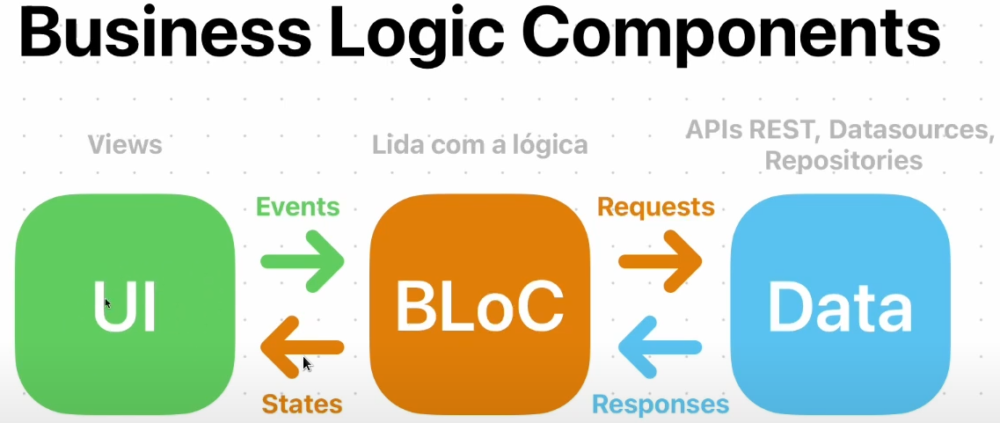

# BloC Pattern

O padrão BloC (Business Logic Components) usa o conceito de `Streams`:

[SINK] -> [Business Logic] -> [STREAM CONTROLLER] -> [STREAM]

- SINK: Entrada de dados;
- Busines Logic: Regra de negócio ou Aquilo que agrega valor para o usuário;
- Stream Controller: Controladores de eventos;
- Stream: Final do fluxo, exibido na interface;

## Business Logic Components

- UI: Usuários interagem com o software com a UI emitindo eventos para o BloC;
- BLoC: Utiliza os eventos e interações para fazer `requests` para os repositories, APIs ou DataSourcers. Dado que o BLoC recebeu uma `response`, ele trata esses dados e envia para a `UI` se renderizar novamente à partir da emição de um `State`.
